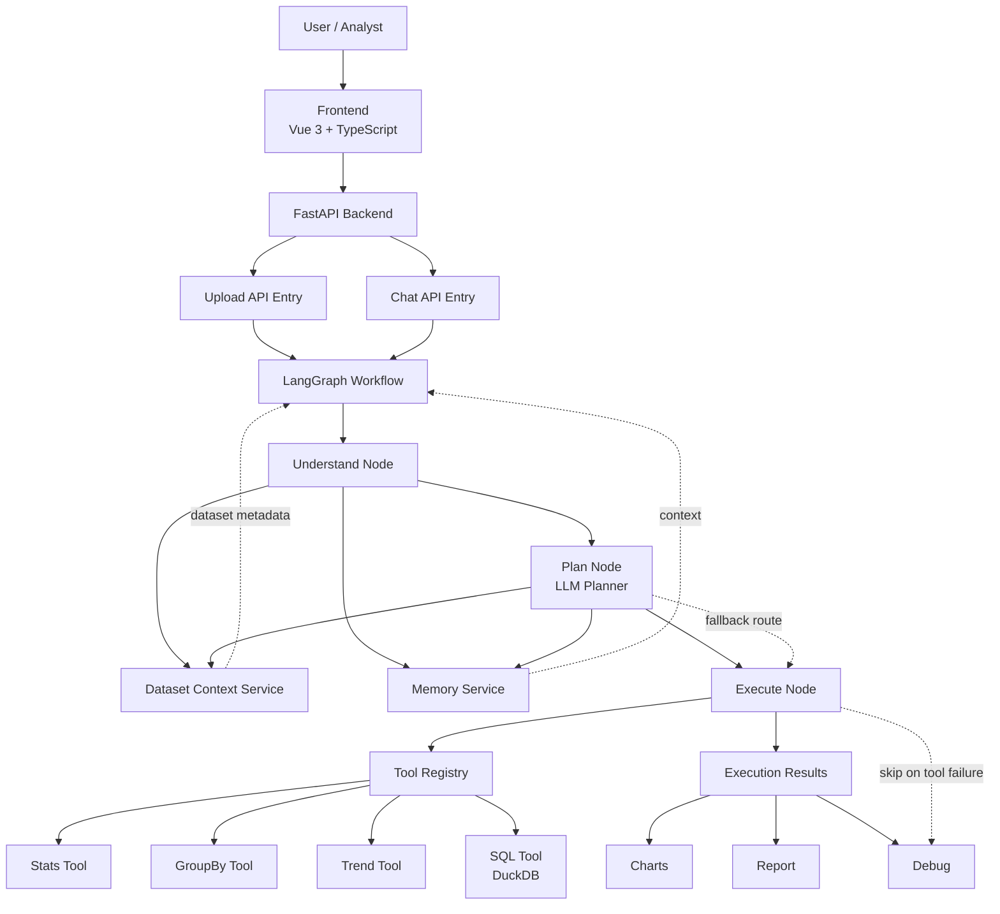

# AI Data Analyst Agent

## 项目介绍

AI Data Analyst Agent 是一个面向面试展示和原型验证的数据分析智能体项目。系统支持上传 CSV / XLSX 文件，并通过自然语言驱动分析流程，自动完成数据理解、任务规划、工具执行、结果生成和调试追踪展示。

当前项目重点体现以下能力：

- 数据集上传与解析
- 基于 LangGraph 的工作流编排
- LLM Planner 任务规划
- Pandas / DuckDB 工具执行
- 图表、报告与调试信息输出
- Fallback 与 Trace 可观测性

## 技术栈

后端：

- FastAPI
- LangGraph
- Pandas
- DuckDB
- DashScope Compatible API
- SQLAlchemy

前端：

- Vue 3
- TypeScript
- Vite
- Element Plus
- Pinia
- ECharts

## 架构图



更详细的架构说明见：

[Architecture Documentation](docs/architecture.md)

## 快速启动

### 后端启动

```bash
cd backend
pip install -r requirements.txt
uvicorn app.main:app --reload
```

默认启动地址：

- `http://127.0.0.1:8000`

### 前端启动

```bash
cd frontend
npm install
npm run dev
```

默认启动地址：

- `http://127.0.0.1:5173`

### Docker 启动

```bash
docker compose up --build
```

### 环境变量

可参考 `.env.example`：

```env
POSTGRES_DB=ai_data_analyst
POSTGRES_USER=postgres
POSTGRES_PASSWORD=postgres
POSTGRES_PORT=5432
BACKEND_PORT=8000
FRONTEND_PORT=5173
DASHSCOPE_API_KEY=your_api_key_here
LLM_MODEL=deepseek-v4-flash
EMBEDDING_MODEL=text-embedding-v3
```

## 使用示例

### 示例 1：上传销售数据

上传 `sales.csv` 后，系统会自动返回：

- 文件基础信息
- schema 与 preview
- AI summary 与 suggestions
- 执行结果
- debug trace

### 示例 2：按产品统计销售额

示例问题：

```text
按 product 统计 sales 总和
```

### 示例 3：分析销售趋势

示例问题：

```text
绘制销售趋势图
```

### 示例 4：查看执行链路

上传完成后，可在 Debug 面板中查看：

- execution path
- node status
- trace log
- fallback summary

## Debug

当前系统支持面向演示和排障的调试模式。上传接口返回结果中会包含结构化的 debug / trace 信息，用于展示 LangGraph 实际执行路径和每个节点的运行状态。

重点字段包括：

- `execution_path`
- `node_status`
- `trace_log`
- `fallback_summary`

典型用途：

- 观察理解、规划、执行节点的真实运行顺序
- 判断某个节点是否走了 fallback
- 查看每一步的输入摘要与输出摘要
- 辅助面试演示与问题排查

## 当前状态

当前项目已完成的主要能力：

- Upload：已完成
- LangGraph Workflow：已完成
- Data Understanding：已完成
- Planner：已完成
- Pandas Execution：已完成
- DuckDB SQL Tool：已接入结构层
- Debug / Trace Observability：已完成
- Frontend DebugPanel：已完成

当前项目适合作为 V1 面试展示版，重点突出：

- Agent workflow 设计
- 容错与 fallback 机制
- 工具编排能力
- 可观测性与调试能力

后续可继续扩展的方向：

- RAG 知识库
- 长期记忆
- 用户体系
- 权限管理
- 报告导出
